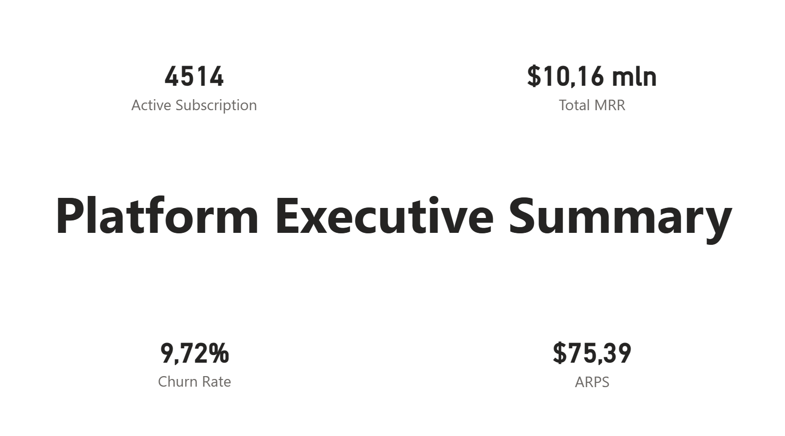
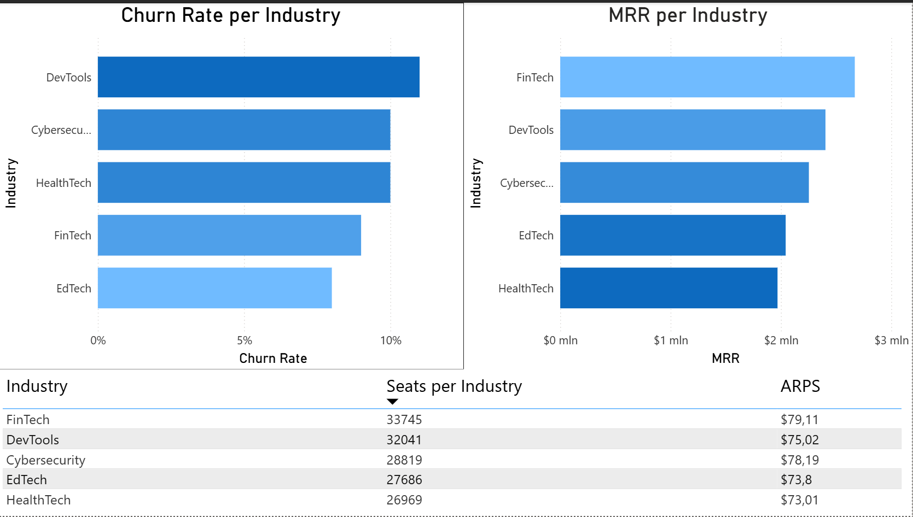
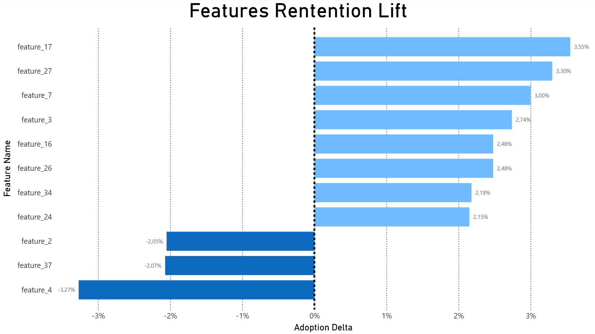
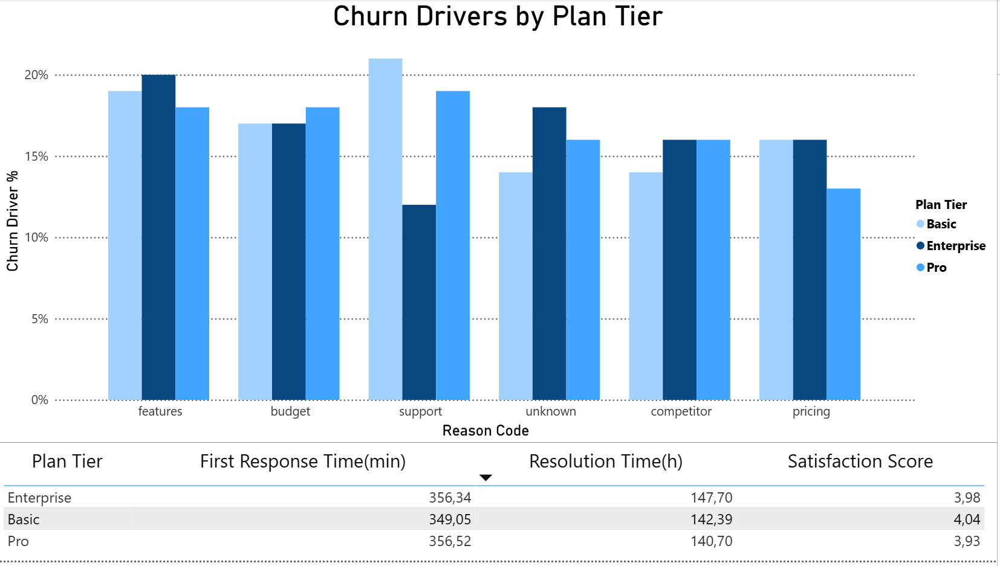

# SaaS Platform Analytics (Churn, MRR, Feature Adoption)

## Project Overview
This project analyzes a SaaS subscription platform to understand **MRR performance, churn, and feature adoption**
across plan tiers and industries.  
The goal is to identify **retention drivers**, **churn risk factors**, and **growth opportunities**.

The project combines:
- **Python analytics** (data preparation, feature engineering, metrics)
- **Power BI dashboard** for executive-level reporting and insights

---

## Key Metrics (Dashboard)
- **Active subscriptions:** 4,514  
- **Total MRR:** $10.16M  
- **ARPS:** $75.39  
- **Churn rate:** 9.72%

---

## Business Questions
- Which **industries** generate the highest MRR and how does churn vary across them?
- Which **product features** are associated with higher retention?
- How does **feature adoption** differ by **plan tier** (Basic / Pro / Enterprise)?
- What are the dominant **churn reasons** by plan tier?
- Where are the largest **retention and expansion opportunities**?

---

## Key Insights
- **FinTech** is the strongest segment, combining high MRR with relatively low churn and strong adoption of retention-positive features.
- **HealthTech** shows weak product–feature fit, with limited retention uplift and several underperforming features.
- Churn correlates more strongly with **feature mix** than with the total number of adopted features.
- Churn reasons are broadly consistent across plan tiers, suggesting that **perceived value** plays a larger role than support quality alone.

---

## Dashboard Preview

### Executive Summary


### MRR and Churn by Industry


### Feature Adoption vs Retention


### Churn Reasons by Plan Tier


> The screenshots above represent the most important analytical views from the Power BI report.
> Together they provide a complete overview of revenue performance, churn dynamics,
> and feature-driven retention patterns.

---

## Deliverables

### Notebooks
- `notebooks/01_data_preparation.ipynb`  
  Data cleaning and preparation (types, missing values, joins, feature tables).
- `notebooks/02_analysis.ipynb`  
  Churn, MRR, and feature adoption analysis with exported metrics.

### Power BI
- `dashboard/saas_analysis.pbix` – interactive report  
- `dashboard/saas_analysis.pdf` – static export  
- `dashboard/saas_analysis.pptx` – presentation-ready slides

---

## Dataset
This project uses the public Kaggle dataset:

**SaaS Subscription and Churn Analytics Dataset**  
https://www.kaggle.com/datasets/rivalytics/saas-subscription-and-churn-analytics-dataset

The dataset is **not included** in this repository.

To run the project locally:
1. Download the dataset from Kaggle
2. Place the raw files in:
   ```
   data/
   ```
3. Run the notebooks in order:
   ```
   notebooks/01_data_preparation.ipynb
   notebooks/02_analysis.ipynb
   ```

---

## Repository Structure
```
saas-platform-analytics/
├── README.md
├── requirements.txt
├── .gitignore
├── notebooks/
│   ├── 01_data_preparation.ipynb
│   └── 02_analysis.ipynb
├── dashboard/
│   ├── saas_analysis.pbix
│   ├── saas_analysis.pdf
│   └── saas_analysis.pptx
├── assets/
│   ├── executive_summary.png
│   ├── industry_mrr_churn.png
│   ├── retention_lift_features.png
│   └── churn_reasons.png
├── data/
└── outputs/
```

---

## Tech Stack
- Python (pandas, numpy)
- Power BI
- Jupyter Notebook

---

## Business Value
This analysis helps product and revenue teams:
- prioritize **retention-focused initiatives**
- align **feature strategy** with churn reduction
- identify **high-value customer segments**
- support data-driven roadmap and pricing decisions

---

## Author
Krystian Walczak
